# Aleria Items & Equipment

Items in Aleria are often found as random treasure on piles throughout the world, or dropped by lair creatures (Bandit Lord, Warlord, Ghoul Lord, Craymen). Many items are rare and unpredictable in where they spawn.

## Body Armor

| Item | Notes |
|------|-------|
| **Hag Plate** | Rare armor piece. 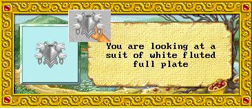 |

## Cloaks

| Item | Notes |
|------|-------|
| **Camo Robes** | From Seldair -1/-2. +2 Agility, +1 hiding. Best Thief cloak. Found on lair crits (Bandit Lord, Warlord). |
| **SeaHag Robe** | Rare robe drop. 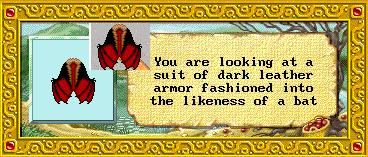 |
| **Easter Robe** | Event-only item from Easter events. No longer obtainable if missed. 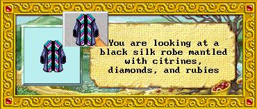 |
| **Aspen's Cloak** | Functions as a sort of Reggie (regeneration). |

## Gauntlets

| Item | Notes |
|------|-------|
| **Pally Gaunts** | Rare gauntlets. 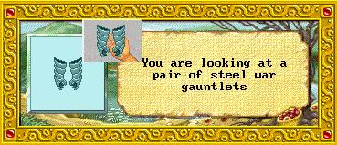 |

## Boots

| Item | Notes |
|------|-------|
| **MoonBoots** | Rare boots with psi reduction. 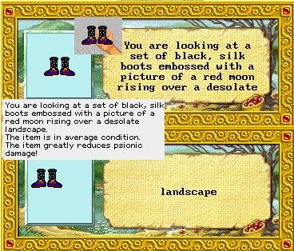 |

## Weapons

| Item | Notes |
|------|-------|
| **Goblin King Axe** | From Goblin King. +4, with Transmute level 13. Tradeable for Light Ring. |
| **Def. Axe** | Found in the desert near Mujaba and other random locations across Aleria. 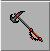 |
| **Def. Hally** | Craymen defense halberd. Found on any Crayman in Aleria (visible in their hand) or as random treasure. 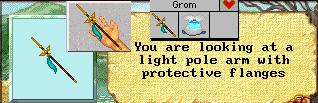 |
| **Def. Sword** | Random find across Aleria. 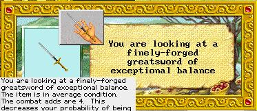 |
| **Koss Mace** | Associated with Lord Koss's forces. 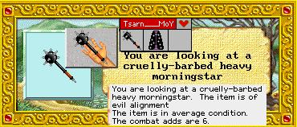 |
| **Obsidian Dagger** | Rare dagger. 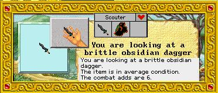 |
| **Silver Short Sword** | Rare silver weapon. 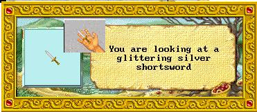 |
| **Dread Sword** | Rare sword. 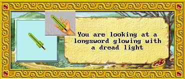 |
| **Berovar Sword** | Extremely rare weapon. Provider wished to remain anonymous and no stats were disclosed. 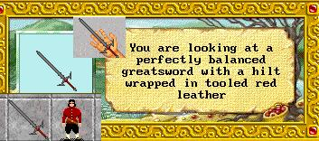 |
| **Warlord Weapons** | Random weapon drops from the Warlord lair creature. |

## Rings & Accessories

| Item | Notes |
|------|-------|
| **Ghoul Lord Drops** | Ghoul Lord drops random rings, bracers, and gauntlets. |
| **Light Ring** | Obtained by trading a Goblin King Axe. |

## Miscellaneous

| Item | Notes |
|------|-------|
| **Multi-colored Feathers** | Unknown function. Properties and uses undetermined. 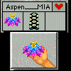 |

## Potions & Consumables

| Item | Notes |
|------|-------|
| **Alerian CHA Fix** | From n/n quest. One of the few ways to fix Charisma. Nearly impossible for new players. |

## Aleria Quest Notes

- **P-ammy Quest**: Words found on statues by the pond provide clues.
- **Good Quest**: Detailed quest available for good-aligned characters.
- Trolls and Ogres cannot see in the dark — use this to your advantage.
