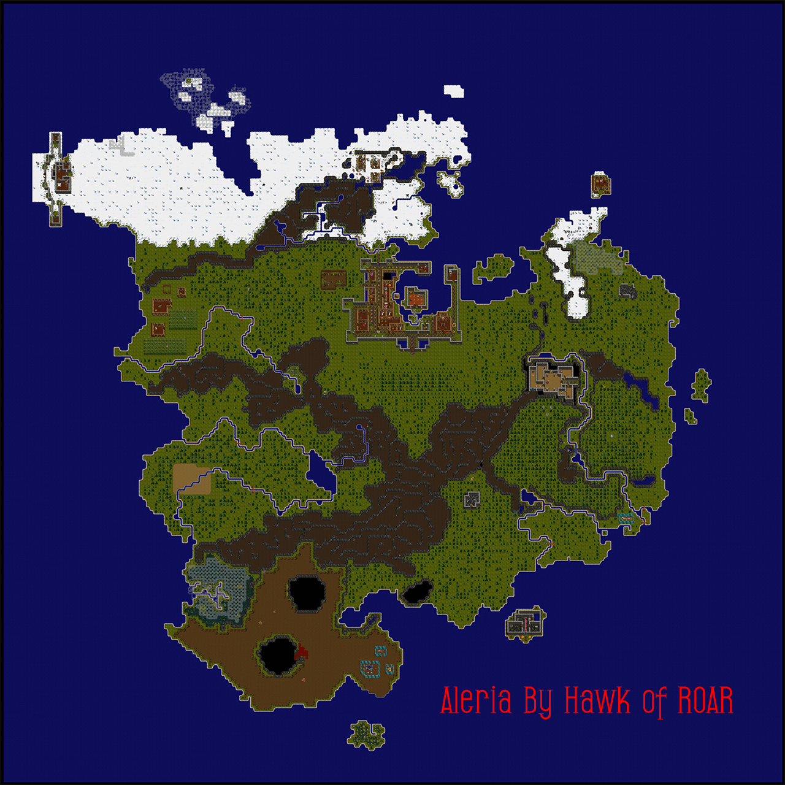
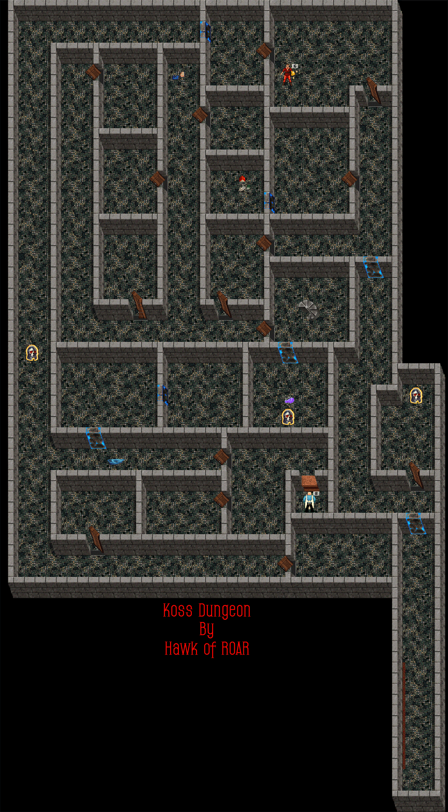
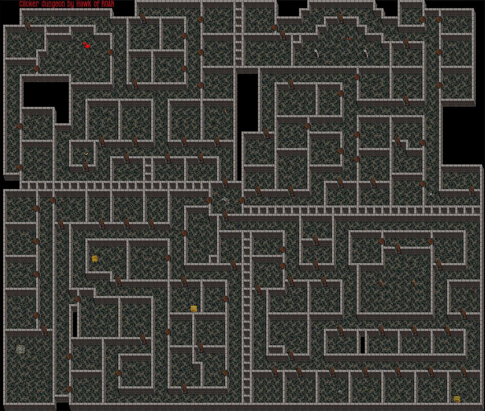
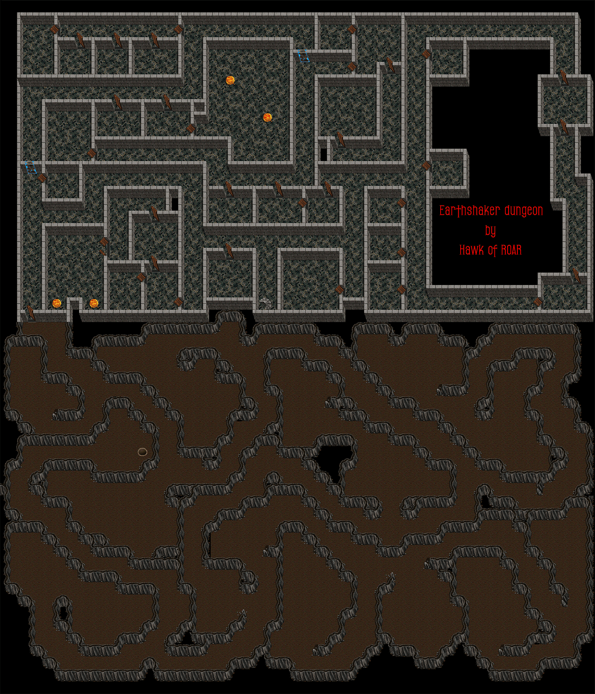
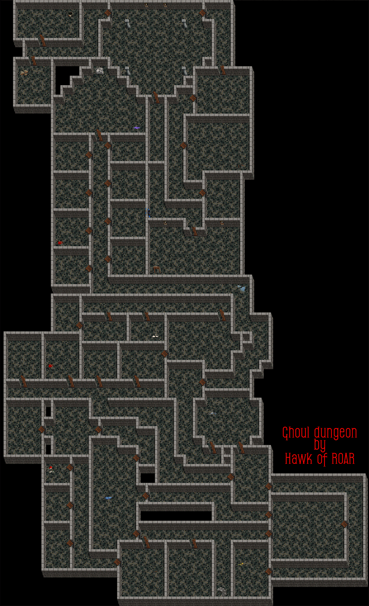
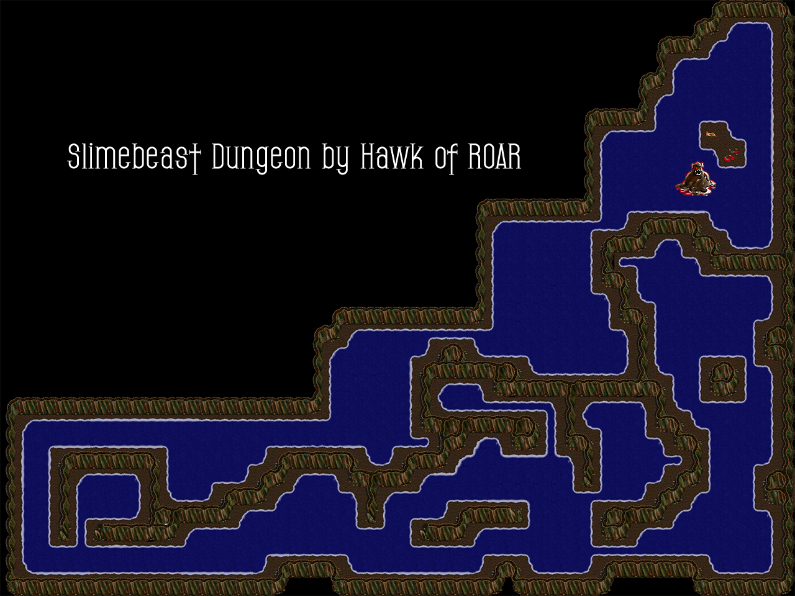
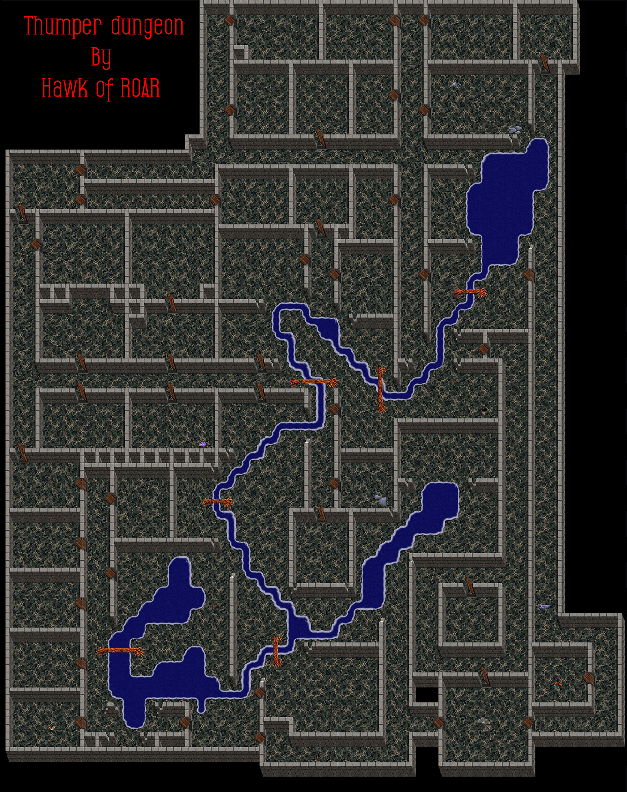
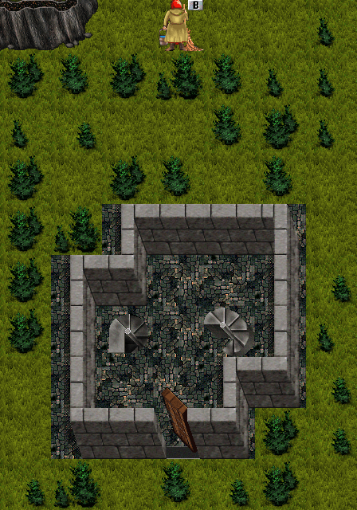

# The World of Aleria

Aleria is one of the advanced game worlds in Kingdom of Drakkar, described as "a new realm, a land of danger and mystery." Less thoroughly documented in the fan site archives than Nork or Cobrahn.

## Lore

The lore of Aleria is delivered through the character **Finri**:

> *"Come, gather 'round once again, ye mighty. Urmak the Boatman has returned to me with tales of Aleria. A terrible war rages across its lands. Duke Talinar has rallied the Forces of Light to his banner, but equal is the call from the dread Lord Koss to his Minions of Darkness. Little information has he gathered so far, except that heroes of all colors, of Light of Darkness and of the Grey Mists, are preparing for the day when Mayor Dagano gives his nod to Urmak, to begin the great ferry to Aleria. Undoubtedly, he will choose those with the Honor of Ratburrow to make the perilous crossing. What we do know from Urmak's fearful chattering is that a mighty war rages between the Citadel and the dread Tower of Koss. Where there is war, there is gold and glory... and early death."*

**Key lore elements:**
- **Duke Talinar** leads the Forces of Light from the Citadel
- **Lord Koss** commands the Minions of Darkness from the Tower of Koss
- **The Grey Mists** represent a third faction
- **Urmak the Boatman** ferries players to Aleria
- **Mayor Dagano** authorizes the crossing
- Players need the **Honor of Ratburrow** to travel there

## Key Information

- One of the end-game worlds with challenging content
- Has its own unique monsters, items, and quests
- Players typically move to Aleria after progressing through Nork
- Contains the **Alerian n/n quest** - one of the few ways to fix Charisma
- **Regen rate** was notoriously slow. Players described it as "always been sluggish" and asked for it to be "tweaked up." Brad acknowledged it had a specific level range where it was effective and said "if it needs tuning, we will tune it."
- Alerian weapons existed but were rare - players asked for them to be more common or added to lair creature drops
- **Webscry** functionality was previously available but had been removed. Brad said "some form of it" would return, with user-allowable "invisibility" for privacy.
- Had a boat (the **Urmak**) connecting it to other areas. Taking the boat was rumored to cause Mentalists to lose their memorized teleport locations. Experienced players used the Guild Hall portal instead.
- Aleria had its own alt world (Alt 2)
- Stat pot traders in Nork Alt 2 could raise stats to 19 - players suggested this be added to help with Aleria preparation

## Notable Areas

### Koss Lair

Multi-floor dungeon structure connected to Aleria:
- **Koss Surface** - Entry level
- **Koss +1** - Second floor
- **Koss Lair** - Underground lair

Navigation between all three floors is possible.

### Northwest Caves
- **NW Caves (Surface)** - Links to Aleria, Carenna, BanditLord, and NW Caves -1
- **NW Caves -1** - Underground level. Once you come down from Northwest Caves at the surface, you can wander around these lower caves until you find the Kragen Lair. The Kragen is a bit tough but a worthwhile fight.

### Arun Secret
Behind Arun's Lair. Contains Pokick and Pomend bosses. Random key drop for door access. Kill Pokick and Pomend for bracers, trade bracers for ring.

### Seldari Forest Navigation
Wear Light Ring through waterfall NW of 3-bird seller. Wear SER for energy missiles. Read statues for mystic words. Travel east to Elshea: "Els, sol kalier kalehn". Receive Poison amulet. Step on goldfish pond to enter S-1.

### King Borav's Hold
Trades Light Rings for GoblinKing Axe: "Kin,axe", "Kin,alliance". Seller sells pickaxes for mining/digging graves.

## Dungeon Maps

### Clickers Dungeon

### Earthshaker Dungeon

### Ghoul Dungeon

### Slimebeast Area

### Thumper Dungeon

### Warlord Tower

## Stormwind's Aleria Guide

Stormwind's Archives contained an Aleria section covering:
- Area descriptions and navigation tips
- Monster information and difficulty levels
- Points of interest and landmarks
- Quest information specific to Aleria
