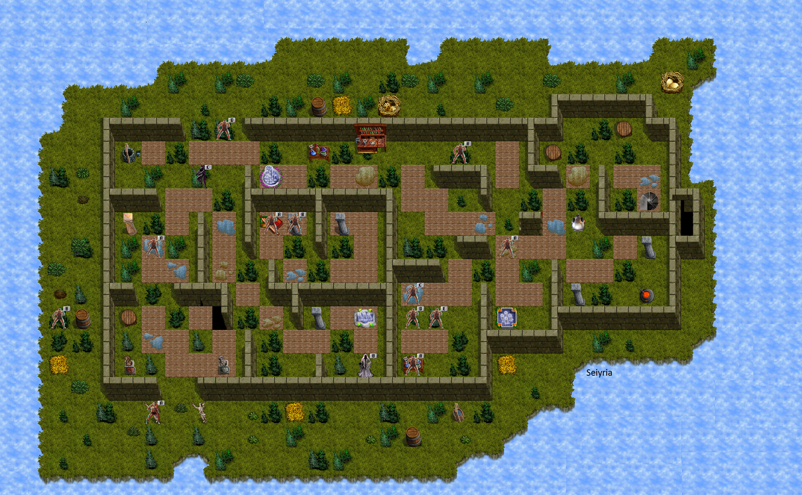

# The World of BDC

Black Dragon Consort (BDC) is an advanced scenario in Kingdom of Drakkar, considered an extension to the [Nameless Lands](../Nameless-Lands/world-nameless-lands.md). BDC shares the same "alts" (alternate characters) with the Nameless Lands. The scenario is part of the broader GDH/BDC/SDC interconnected area chain.

BDC is notable for its harsh acid-themed environment. This place is mostly undesirable to hunt in due to frequent armor breaks caused by acid damage. Players venturing here should bring acid protection gear and be prepared for equipment degradation.

## Entry Requirements

- Access BDC from the **southwest corner of GDH2** (Green Dragon Hatcheries, level 2)
- Talk to the **Arbiter** NPC to enter
- You must first complete the **Trapper climbup** in GDH2 to unlock certain quest NPCs in BDC

## Maps

### BDC Castle

The castle is one of the two main areas of BDC. Key locations on the castle map include:

| Location | Description |
|----------|-------------|
| **Forest Climb Down** | Connects the castle to the forest area below |
| **Stairs to Crypt** | Access point to the underground Crypt dungeon (requires completing the Crypt Access quest) |

### BDC Forest

The forest is the outdoor wilderness area of BDC. Key locations on the forest map include:

| Location | Description |
|----------|-------------|
| **Canniblas** | NPC for the Tengu Skill Progression quest (northwest area) |
| **Hermit** | Lair boss in the southwest corner of the forest |
| **Archaeologist** | NPC for the Crypt Access quest (southeast area) |
| **Black Dragon Consort** | Major lair boss (east-central area) |
| **Acidron Alcor** | Major lair boss (east-central area, west of the Consort) |
| **Castle Climb Up** | Connects the forest to the castle area above |
| **Exit to GDH** | Returns to Green Dragon Hatcheries (far east) |

## Major Locations

### BDC Castle and Garden

The castle is a dark fortress infested with hostile creatures. The castle/garden area is where several random-drop items can be found, including the Crusted Carbon earring and the Heroes Sash. The castle also contains the 4 Spectres that must be killed for the Crypt Access quest.

### BDC Forest

The forest is a sprawling wilderness area surrounding the castle. It serves as the main hunting ground and contains several important NPC locations and lair entrances. Creatures here include Tengu (which drop Tengu Glands for the skill progression quest) and Trolls (which drop various robes and other items).

### The Crypt

The Crypt is an underground dungeon area accessed via stairs in the castle. Access requires completing the Crypt Access quest by collecting 4 Spectre statues and delivering them to the Archaeologist NPC. The Crypt contains the two most powerful lair bosses in BDC: the Black Dragon Consort and Acidron Alcor.

## Lairs

### Acidron Alcor

- **Location**: Crypt
- **Attacks**: Powerful acid attacks. The acid gets stronger when multiple players are stacked on the same hex.
- **Drops**:
  - Acidron Alcor Amulet (6/0, Deadeye III)
  - Acidron Alcor EP Amulet (6/6, EP Regen)
  - Acidron Alcor Robe (+5, +AC, Acid Prot, Base AC 100)
- **Strategy**: Spread out across multiple hexes to reduce the strength of acid breath attacks. Bring acid protection gear.

### Black Dragon Consort

- **Location**: Crypt
- **Attacks**: Casts Acidbreath. Claws you.
- **Drops**:
  - Black Dragon Consort Amulet (3/3, EP Regen)
  - Consort Scales (armor: +2, Acid Prot, Base AC 90, Level 25 req) -- obtained by killing and tanning the Consort
- **Strategy**: Bring acid protection. The Consort uses both breath attacks and melee claws.

### Hermit

- **Location**: Southwest corner of BDC Forest
- **Attacks**: Can stun. Hits hard.
- **Drops**:
  - Hermit Scroll (used for Hermit Skill Progression quest)
- **Related Quests**: Hermit Skill Progression (advance to skill 39)

## NPCs

| NPC | Location | Purpose |
|-----|----------|---------|
| **Arbiter** | GDH2 (southwest corner) | Grants entry to BDC |
| **Trapper** | GDH2 / BDC Forest | Must complete the Trapper climbup in GDH2 first; talk with him in BDC forest to activate the Archaeologist quest |
| **Archaeologist** | BDC Forest (southeast) | Accepts 4 Spectre statues to grant access to the Crypt |
| **Canniblas** | BDC Forest (northwest) | Accepts 10 Tengu Glands for the Tengu Skill Progression quest |

## Creatures

Common creatures found in BDC include:

- **Trolls** -- Found throughout the forest and castle. Drop various robes (Troll Robe, Red Dragon Robe) and other items.
- **Tengu** -- Found in BDC. Drop Tengu Glands needed for the skill progression quest.
- **Spectres** (x4) -- Found in BDC Castle. Drop statues needed for the Crypt Access quest.
- **Leeches** -- Found in GDH (nearby). Drop Acid Pots used in the Tengu Skill Progression brewing recipe.

## Hazards

- **Acid Damage**: The primary environmental hazard in BDC. Acid attacks from creatures (especially the Consort and Acidron Alcor) can break equipment. Bring acid protection items (Crusted Carbon earring, Acidron Alcor Robe, Consort Scales).
- **Armor Breaks**: Equipment degradation from acid is a constant concern. This is the main reason BDC is considered undesirable for extended hunting.
- **Stun Attacks**: The Hermit can stun players, leaving them vulnerable.

## Brewing

BDC creatures drop a large variety of herbs and flowers used in the brewing system. These include:

- American Cowslip
- Bedstraw
- Beggers Button
- Alpine Strawberry
- Alecost
- Bible Leaf
- Aconite
- Artrillil
- Bearberry
- Bishop's Flower
- Yellow Centaurea
- Bigleaf Gentian
- Angel's Fishing Rod
- Bee Balm
- Black Cohosh
- Black Snakeroot
- Anise Hyssop
- Blazing Star
- Blessed Thistle
- Blue Eryngo

These herbs drop from random creatures (crits) throughout BDC and are used in various brewing recipes.

## Connection to Other Scenarios

BDC is part of the GDH/BDC/SDC chain:

- **Green Dragon Hatcheries (GDH)** -- The preceding scenario. BDC is entered from GDH2 via the Arbiter NPC.
- **Silver Dragon Consort (SDC)** -- The next scenario in the chain, accessible from BDC.
- **Nameless Lands (NL)** -- BDC shares alts with the Nameless Lands.
