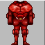
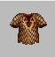
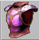

# Cobrahn Items & Equipment

## Body Armor

| Item | Notes |
|------|-------|
| **Padded GD (Gold Dragon) Scales** | Basic Cob armor.  |
| **BD (Black Dragon) Scaler** | Advanced Cob armor.  |
| **SD (Silver Dragon) Scaler** | High-tier scaler armor.  |
| **Beetle Plate** | From PSI Tower. Shockwave protection, fire/ice resist, +6 def, evil aligned.  |
| **Green Dragon Armor** | Dragon-tier armor.  |
| **Vanidor Plate** | From Vanidor Lair.  |
| **Nagi Armor** | Ningizidda-derived armor.  |
| **Nameless Lord Armor** | 230 protect, +5 all stats, damage absorption. End-game armor.  |
| **Double Yeti** | Best Barbarian armor available in Cob (as of 2002). Players wanted better options. |
| **DeathSasquatch Fur** | From DS lair. Barb-only armor: **+200 HP**, 0/7 combat adds. Can enhance titanium shield into "Easter Egg" shield (+200 HP). |

## Cloaks

| Item | Notes |
|------|-------|
| **Red Robes** | Psi-mirror items. Were "broken" - showed reflect messages but didn't actually reflect psi damage from imbued weapons. Brad planned a quest for a slightly better version. |
| **Assault Robes** | ProtAssault. Found in Timmy Secret caves (random drop from Cave Dwellers). |
| **Yellow Robes** | Found in Timmy Town area. |

## Helms

| Item | Notes |
|------|-------|
| **Padded IV Helm** | Standard Cob helmet. |

## Boots

| Item | Notes |
|------|-------|
| **3/3 Boots** | Found in Timmy Secret caves. |
| **Tanned Alligator Boots** | Trade alligator hides to Abner in Tree Town. |

## Shields

| Item | Notes |
|------|-------|
| **Bubble Shields** | Found in Timmy Secret caves. |
| **Titanium Shield** | Can be enhanced into "Easter Egg" shield (+200 HP) with DeathSasquatch Fur. |

## Rings

| Item | Notes |
|------|-------|
| **Graagh Rings** | Cob-specific rings. Part of basic Cob gear set. |
| **Silver Rings** | Rare drop in NW Caves. |
| **ES Rings** | Rare drop in NW Caves. |
| **Bone Rings** | Random drop from Tree Ogres. |
| **Brass Rings** | Random drop from Ninjas. |

## Weapons — Staffs

| Item | Notes |
|------|-------|
| **Lori Staff** | From Lori hunt. +6 skill bonus, +6 EP regen. The best caster weapon. Requires a very difficult group hunt. Combined with Uzi = 11 EP/round. |

## Weapons — Swords

| Item | Notes |
|------|-------|
| **Curvy Longsword** | From Timmy -1. +5 sword, ties. Hits hard. Essential fallback weapon for casters in Cob. |
| **Silver Sword** | +5, glowing. Found in Timmy caves. |
| **Boris Greatsword** | +4 adds, prones. Rare +5 and +6 versions exist. From Borris Lair. |
| **Forged Great Sword** | +4, glowing. |

## Weapons — Halberds & Polearms

| Item | Notes |
|------|-------|
| **Grraaagh Halberd** | From Graagh Castle. +5 STR, on-contact Push, proning. **Barb only.** |
| **Forged Hally** | +4, glowing, prones. |
| **Pike** | +1 combat. Basic Cob polearm. |

## Weapons — Daggers

| Item | Notes |
|------|-------|
| **Kaldor Dagger** | From Kaldor's Lair. Glowing, evil, +2 adds, throwing. **Breaks gear.** |
| **Throwing Dagger** | +4 adds, throwing. |

## Weapons — Maces

| Item | Notes |
|------|-------|
| **Kaldor's Mace** | From Kaldor's Lair. Level 16 stun on-contact, +1 adds. **Breaks gear.** |
| **Firestorm Mace** | +3 adds, level 16-26 firestorm (must throw to activate). |

## Weapons — Bows & Ranged

| Item | Notes |
|------|-------|
| **Energy Spear Bow** | Level 15 Energy Spear on-contact, +3 adds, prones sometimes. |
| **Lightning Spear** | Level 18 lightning, +2 adds, throwing. |

## Amulets

| Item | Notes |
|------|-------|
| **Anti-Steve Amulet** | From Desert Town. **Prevents losing 2 HP on normal death.** Trade a Cthon egg to Murg NPC. |
| **Kaldor Amulet** | From Kaldor's Lair. Boosts Healer skill by 2 levels. |
| **Earthcrush Amulet** | Quest item. Earthcrush protection. |
| **PSI Tower Amulets** | Floor-specific drops: +45 EPS (basement), +4 STR (ground), +4 AGI (floor 1), +5 INT (top). |
| **Arun Robe** | From Ruins of Arun. Worn as amulet/cloak. +10 EP regen. Many colors with gold clasps. |

## Potions & Consumables

| Item | Notes |
|------|-------|
| **Con Seed Packets** | Rare Constitution items. Players wanted more availability. |
| **Mino-Blood** | Could restore hit point losses from lair creatures. Players wanted it as random treasure drops. |
| **CritCure Twigs** | Floor twigs in Timmy (level 20). Consumable resurrection items. |
| **Fireball Twigs** | Floor twigs in Timmy (level 25). Consumable area fire damage. |
| **Icestorm Twigs** | Floor twigs in Timmy (level 20, 25). Consumable area ice damage. |
| **Instant Heals** | Essential consumable healing items for casters in Cobrahn. Sold by IH/succor seller in Doom Town. |
| **Dion Bottles (Fate Water)** | From Dion (wandering NPC). Complex probability system with 20+ outcomes. Common: -1 STR/CON (23%), +1 AGI (10%), +1 WIS (10%). Can give +1-6 EP, +2 CON, +1-2 any stat, training boosts, temporary +3x HP, or spell casts (Absorb, Aid, Strength). Negative outcomes include stat losses and poison. **Warning**: EP cap at 50 resets to 15 if exceeded. Based on a 230-bottle statistical analysis. |
| **STR Pots** | Available from traders in NW Caves (north end) and Giants Keep (west). |
| **EPS Pots** | Available from trader in SW Caves (SE). |

## NPC Traders

| NPC | Location | Service |
|-----|----------|---------|
| **Abner** | Tree Town | Boots trader (trade tanned hides for boots) |
| **Murg** | Desert Town | Anti-Steve Amulet (trade Cthon egg) |
| **Jasper** | Desert Town (random spawn) | Regen trader |
| **Dion** | Wandering | Fate pot trader |
| **HP Doctor** | Desert Town (SE) | Hit Point restoration (1 HP per crit, max 550 base at level 20 Pally) |
| **IH/Succor Seller** | Doom Town | Instant Heals and succor scrolls |
