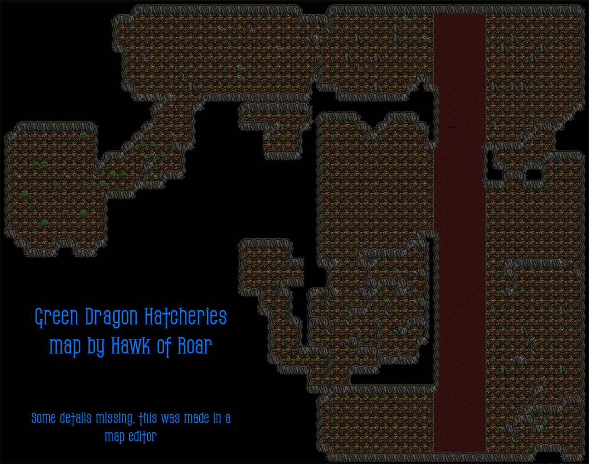
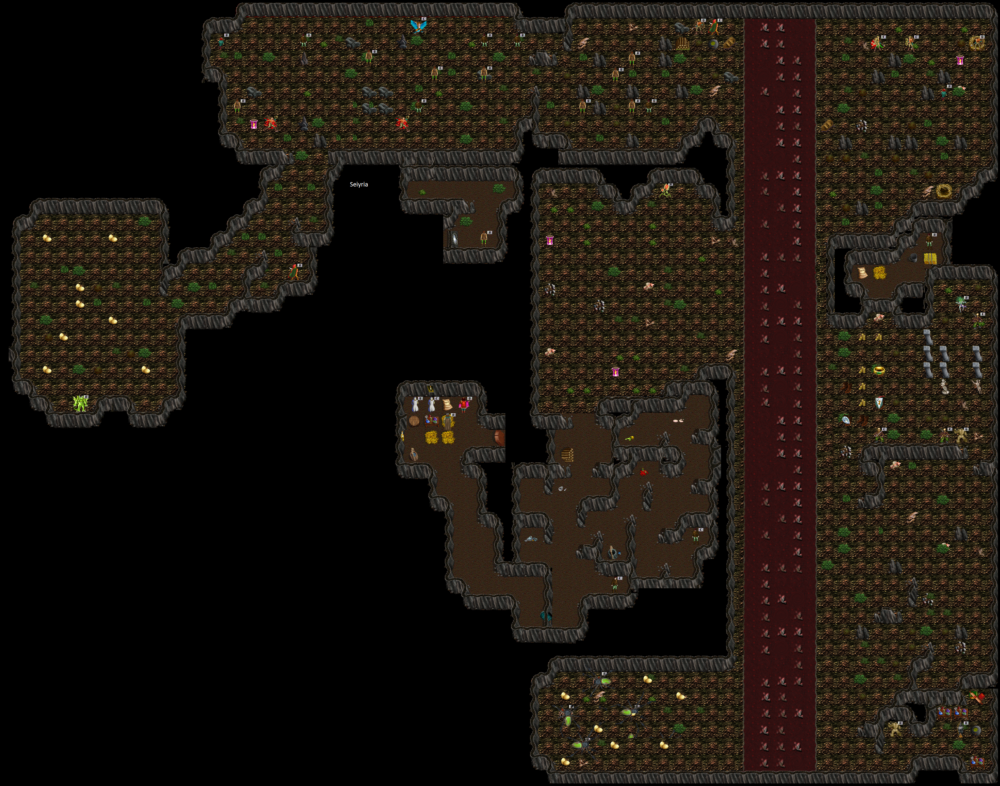
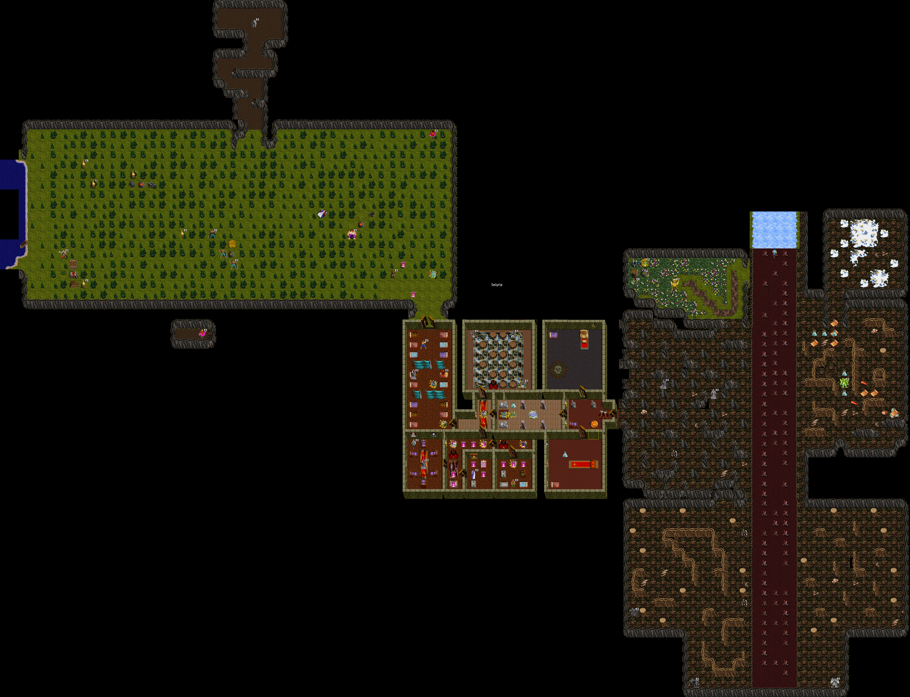
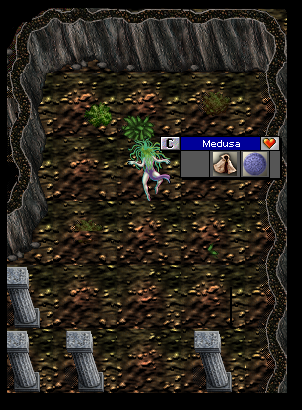
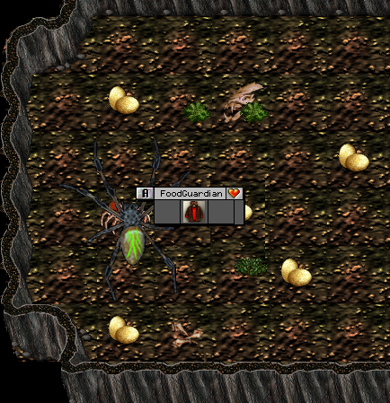
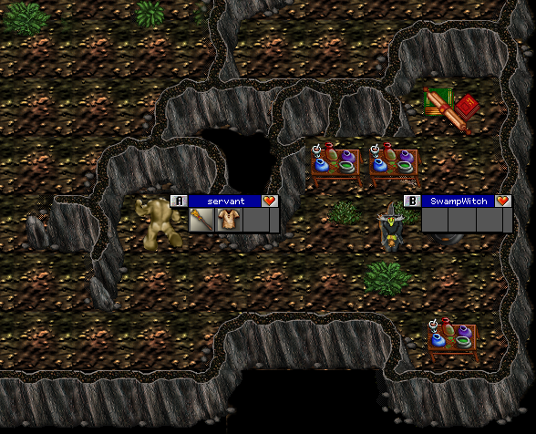

# The World of GDH

Green Dragon Hatcheries (GDH), also known as Grathyl, is considered an extension to the Nameless Lands and shares the same "alts" (alternate characters) with it. GDH is a mid-to-high level scenario in Kingdom of Drakkar, with content starting around level 40 but realistically requiring level 60-70+ to make meaningful progress.

GDH is split into two major parts, commonly referred to as **GDH1** and **GDH2**. Players must complete progression quests to advance from one area to the next. GDH2 also serves as the gateway to the Black Dragon Consort (BDC) and Silver Dragon Consort (SDC) scenarios.

## Entry Requirements

- **Level Requirement**: Level 40 minimum
- **Entry via Acrona**: Say `acr, go` when you are level 40
- **Entry via Jilian**: If subscribed to Upper Guild Hall, use `jil, gdh`

## Maps

### GDH Overview

### GDH Area 1 (GDH1)

### GDH Area 2 (GDH2)

GDH1 is divided into four sub-areas, unlocked sequentially through progression quests. The first area contains the entry point and introductory content. Each progression quest opens access to the next sub-area, culminating in the FoodGuardian fight that grants access to GDH2.

## Major Locations

### GDH1 - First Area (Introduction)
The starting zone of GDH. Contains:
- **Farmer** - NPC who trades a Gatherer Feather for the Gatherer Robe
- **Botanist** - NPC for Progression Quest 1 (trade a Hatchling Scale to advance)
- **Official** - NPC for the Vine Shield quest (rescue 10 LostFarmers)
- **Captain** - NPC for the Vine Sash quest (trade 20 Canteens)
- Hatchling spawns in the southwestern portion
- Militia patrols throughout the area

### GDH1 - Second Area (Escapee Caves)
Accessed after completing Progression 1. Contains:
- **LucidEscapee** - NPC in the Escapee Caves, needed for Progression Quest 2
- **Sturderon** - NPC who trades a Needler Heart for the Needler Ring
- Needler spawns in this area
- Mercenary patrols that drop Mercenary Twigs
- Lunches (wandering NPCs used for the Progression 2 quest)

### GDH1 - Third Area (Medusa / Beholder Area)

Accessed after completing Progression 2. Contains:
- **Barnlot** - NPC near Medusa who trades Hatchling Scales for the Combat Earring
- **Beholder Lair** - Boss that drops the Beholder Staff (needed for Medusa activation)
- **Medusa Lair** - Boss that drops the Medusa Gem and Medusa Shield
- **Servant** - NPC in the SwampWitch/Golem area, needed for Progression 3
- Stone Golems that drop Golem Essence

### GDH1 - Fourth Area (FoodGuardian / SwampWitch Area)

Accessed after completing Progression 3. Contains:
- **FoodGuardian Lair** - Major boss in the far southwest corner. Drops class-specific gauntlets, FoodGuardian Sash, and the Climbing Twig needed for Progression 4
- The climb-up point to GDH2 is in the southwest-most hex of the swampwitch side of the water

### GDH2 - Main Area
Accessed after completing Progression 4 (obtaining and using the Climbing Twig). This is a large area containing:
- **Castle** - A fortified area requiring keys to access. Contains the Wackaflexes mini-game
- **Barbarian Fields** - A combat area accessed via the Barbarian Fields Access quest, featuring barbarian camps that drop tier spells
- **Dragon River** - Location of the Thermature lair
- **Gipler** - NPC who trades Pure Water for a Basic Bow
- **Armon** - NPC who trades Pure Water for a Basic Glaive
- **Silvuh** - NPC located in GDH2
- **Black Dragon Arbiter** - Portal to Black Dragon Consort (BDC)
- **Silver Dragon Arbiter** - Portal to Silver Dragon Consort (SDC)

### GDH2 - Castle
Accessed through the Castle Access quest (finding keys from nearby NPCs and Merc Captains). Contains:
- **Wakka** - NPC behind a locked door for the Wackaflexes quirk quest
- **Cook** - NPC in the kitchen who accepts Infected Apples for the Barbarian Fields Access quest
- **Danfur** - NPC near the locked door to the Barbarian Fields who provides the key after completing prerequisite tasks
- **Merc Captain Lairs** - Two Merc Captain boss locations that drop keys for deeper castle access

### GDH2 - Barbarian Fields
Accessed through the Barbarian Fields Access quest. Contains:
- **Smokie** - NPC in the northeast of the fields who trades 10 Bear Meat for Smoked Bear Meat
- **Krog** - NPC who improves your Thermature Ring (requires Smoked Bear Meat and a Thermature Ring)
- **Marton** - NPC who trades a Milky Gem and Red Robe (both brewed) for the Marton Robe
- **Trapper** - NPC accessed by climbing up from the south side using Climbing Hooks (from Cave Bear). Give Bear Beer to start the Bear None encounter
- **Cave Bear Lair** - Boss that drops Climbing Hooks and Bear Meat. Grey to evil characters. Gets nastier if the fight takes too long. Goes into a frenzy if it kills someone
- Four **Barbarian Camps** that drop tier spells:
  - **SW Barbarian Camp**: Drops tiers -- Gaze of the Wild, Echo of Decay, Taloned Barbs, Hemorrhagic Fever, Ankor's Fire, Tempuric Firestorm, Wave of Good
  - **NW Barbarian Camp**: Drops tiers -- Sweat of Deplurium, Echo of Disease, Dragon Sting, Avatar Health, Apocalyptic Delirium, Illumnic Hammer, Shield of Nobility
  - **Center Barbarian Camp**: Drops tiers -- Gaze of the Wild, Echo of Decay, Taloned Barbs, Hemorrhagic Fever, Ankor's Fire, Tempuric Firestorm, Wave of Good
  - **E Barbarian Camp**: Drops tiers -- Sweat of Deplurium, Echo of Disease, Dragon Sting, Avatar Health, Apocalyptic Delirium, Illumnic Hammer, Shield of Nobility

## Lairs

### Beholder
- **Location**: Medusa Area (GDH1, Third Area)
- **Behavior**: Sucks EXP and Skill on hit
- **Drops**: Beholder Staff
- **Related Quest**: Progression 3

### Cave Bear
- **Location**: GDH2 (Barbarian Fields area)
- **Behavior**: Grey to evil characters. Gets nastier if you take too long. When he kills someone, he goes into a frenzy and charges everyone until they are all dead or until he is blocked. Takes EXP/Skill when hitting.
- **Drops**: Climbing Hooks, Bear Meat
- **Related Quest**: Bear None

### FoodGuardian
- **Location**: Far southwest corner of GDH1, Fourth Area
- **Behavior**: Sucks EXP and Skill on hit. Can hit up to 8 times per round, 4 strikes max per target. Reflects melee damage.
- **Drops**: Barbarian Gauntlets, Healer Gauntlets, Mentalist Gauntlets, Paladin Gauntlets (Fighter Gauntlets), Thief Gauntlets, FoodGuardian Sash, Climbing Twig
- **Related Quest**: Progression 4

### Hatchlings
- **Location**: Southwest of the first GDH area
- **Behavior**: Claws, Kicks. Multiple hatchlings in the lair area.
- **Drops**: Hatchling Earring
- **Tans Into**: Hatchling Armor + Hatchling Scale (used for Progression 1 and Combat Earring quest)

### Medusa
- **Location**: Medusa Area (GDH1, Third Area)
- **Behavior**: Can be walled in using Illusion to help manage the surrounding enemies
- **Activation**: Hold both a Beholder Staff and a Golem Essence, then right-click the essence
- **Drops**: Medusa Gem, Medusa Shield
- **Related Quest**: Progression 3

### Merc Captain
- **Location**: GDH2 (two locations in the castle area)
- **Behavior**: Has a strong attack that can one-shot players. High HP regeneration.
- **Drops**: Keys for deeper castle access
- **Related Quest**: Castle Access

### Thermature
- **Location**: Dragon River (GDH2)
- **Behavior**: Bites, Claws, casts Icebreath (can hit for 3,000 damage)
- **Drops**: Thermature Ring, Thermature Robe, Ember

## NPCs

| NPC | Location | Purpose |
|-----|----------|---------|
| **Farmer** | GDH1, First Area entrance | Trades Gatherer Feather for Gatherer Robe |
| **Botanist** | GDH1, First Area | Progression 1 (accepts Hatchling Scale) |
| **Official** | GDH1, First Area | Vine Shield quest (rescue LostFarmers) |
| **Captain** | GDH1, First Area | Vine Sash quest (accepts 20 Canteens) |
| **LucidEscapee** | GDH1, Escapee Caves | Progression 2 |
| **Sturderon** | GDH1, Second Area | Trades Needler Heart for Needler Ring |
| **Barnlot** | GDH1, Third Area (near Medusa) | Trades Hatchling Scales for Combat Earring |
| **Servant** | GDH1, SwampWitch/Golem Area | Progression 3 (accepts Medusa Gem) |
| **Gipler** | GDH2, First Area | Trades Pure Water for Basic Bow |
| **Armon** | GDH2, First Area | Trades Pure Water for Basic Glaive |
| **Silvuh** | GDH2 | NPC |
| **Cook** | GDH2, Castle Kitchen | Accepts Infected Apples for Barb Fields Access |
| **Chef** | GDH2 | Must be protected for 80 rounds (Barb Fields Access) |
| **Danfur** | GDH2, near Barb Fields door | Gives Barbarian Fields Key |
| **Smokie** | GDH2, Barbarian Fields (NE) | Trades 10 Bear Meat for Smoked Bear Meat |
| **Krog** | GDH2, Barbarian Fields | Improves Thermature Ring (requires ring + Smoked Bear Meat) |
| **Marton** | GDH2, Barbarian Fields | Trades Milky Gem + Red Robe for Marton Robe |
| **Trapper** | GDH2, south side of Barb Fields (climb up) | Bear None quest (give Bear Beer to start encounter) |
| **Wakka** | GDH2, Castle (behind locked door) | Wackaflexes quirk quest |
| **Black Dragon Arbiter** | GDH2 (south) | Portal to Black Dragon Consort |
| **Silver Dragon Arbiter** | GDH2 (south) | Portal to Silver Dragon Consort |

## Creatures and Enemies

GDH is populated by a variety of creatures across its areas:

- **Militias** - Found throughout GDH1. Drop Canteens, Militia Leather, Mail, Plate, Militia Sabre, Militia Staff, Chiton Boots
- **Hatchlings** - Dragon hatchlings in GDH1. Tan into Hatchling Armor + Hatchling Scale. Drop Hatchling Earring
- **Swampcats** - Found in GDH1. Tan into Swampcat Fur (AC 100, Swampcat Accuracy)
- **Gatherers** - Found in GDH1. Drop Gatherer Feather
- **Mercenaries** - Found throughout GDH. Drop Mercenary Twigs
- **Needlers** - Found in GDH1, Second Area. Drop Needler Heart
- **Escapees** - Found in the Escapee Caves. Carry Escapee Halberds
- **Stone Golems** - Found in GDH1, Third Area. Drop Golem Essence
- **Beholders** - Lair boss in Third Area
- **Miasmites** - Can drop Hatchling Earrings
- **Leeches** - Found in GDH. Drop Acid Pots (used for brewing)
- **Remains** - Can rarely drop Medusa Gem
- **Mature Green Dragons** - Found in GDH2. Drop Green Dragon Tongue
- **Youth Green Dragons** - Found in GDH2. Drop Green Dragon Blood
- **Barbarians** - Found in Barbarian Fields camps. Drop tier spells
- **Bears** - Found in Barbarian Fields. Drop Bear Meat
- **Mercenary Advisors** - Drop Blue Merc Gem (used in brewing)

## Brewing in GDH

GDH introduces the brewing system heavily. Many herbs and reagents drop as "crits" (critical drops) throughout GDH, BDC, and SDC areas. Key brewing reagents found in GDH include:

- **Acid Pot** - Dropped by Leeches, used in various brewing recipes
- **Herbs/Flowers**: American Cowslip, Bedstraw, Beggers Button, Alpine Strawberry, Alecost, Bible Leaf, Aconite, Artrillil, Bearberry, Bishop's Flower, Yellow Centaurea, Bigleaf Gentian, Angel's Fishing Rod, Bee Balm, Black Cohosh, Black Snakeroot, Anise Hyssop, Blazing Star, Blessed Thistle, Blue Eryngo
- **Bear Beer** - Brewed from Smoked Bear Meat + other reagents (requires brewing skill 13-15)
- **Pure Water** - Brewed item needed for Basic Bow and Basic Glaive quests (requires brewing skill 11)
- **Milky Gem** and **Red Robe** - Both obtained through brewing, traded to Marton for the Marton Robe

## Connections to Other Scenarios

- **Nameless Lands**: GDH is an extension of NL and shares alt characters
- **Black Dragon Consort (BDC)**: Accessed via the Black Dragon Arbiter in GDH2
- **Silver Dragon Consort (SDC)**: Accessed via the Silver Dragon Arbiter in GDH2
