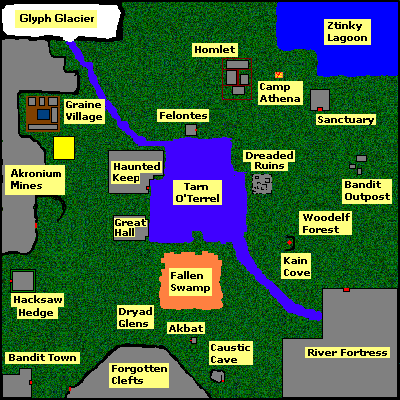
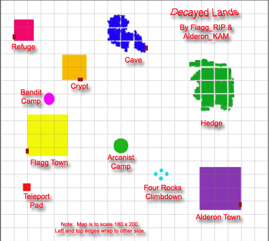
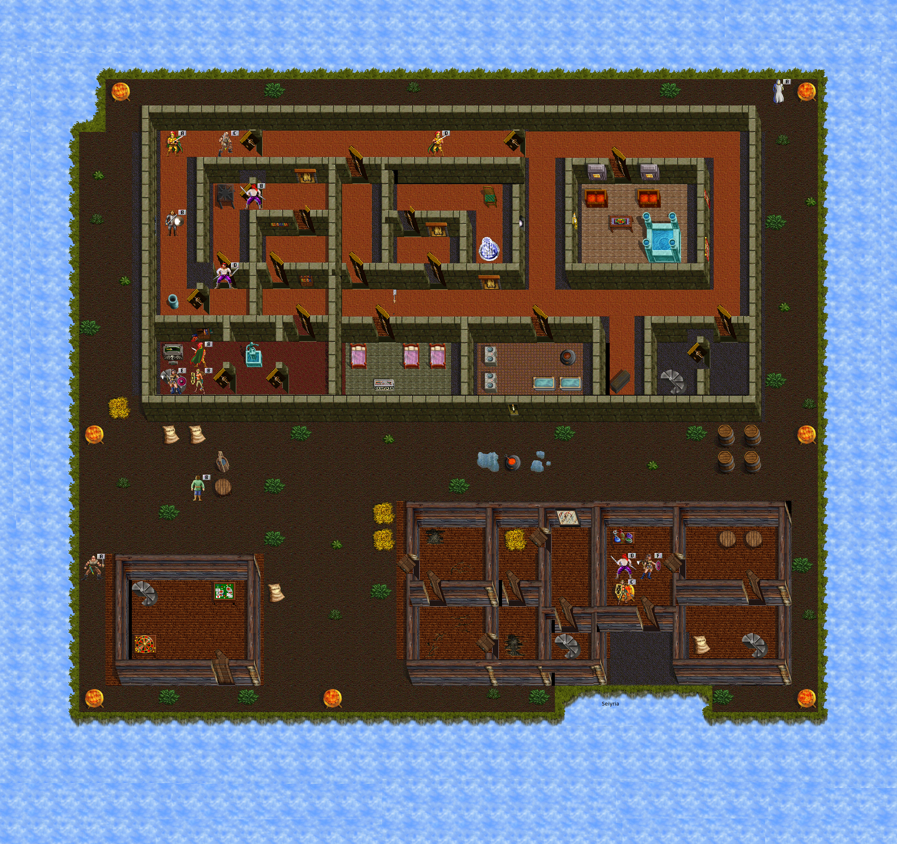

# The Nameless Lands

"Nameless" or "NL" is a newer game scenario accessible from Nork through a tear/rift that opened in the borderlands. A mysterious realm with its own distinct content and equipment sets.

## Lore

A rift opened in the borderlands of Nork, leading to a mysterious realm. Rumors speak of a threat named **Arcturus** stirring beyond the rift. The land contains ancient psionic power and rare resources.

## Key Information

- Accessible from Nork through the rift
- Contains **Akronium ore**, a unique material found only here
- Contains **Mormar**, a 25-level dungeon with the Rift Guardian on floor 26
- Mormar is accessed through the Decaying Lands Bog
- **Dornar Dungeon** is another dungeon in this region
- The ROAR Guild maintained lists of NL Items, NL Weapons, NL Rings, and NL Robes
- Has its own unique equipment sets distinct from other scenarios
- Mormar floor progression requires completing the **Mormar Entry Quest**

## Notable Areas

- **Decaying Lands Bog**: Entry point to Mormar dungeon. The swamp gained walls on all sides and no longer wraps around.
- **Sullen Keep**: Expansion area for levels 85-90 (added January 2016). Contains mini bosses, new damage types, and random stat potions (max 35). 
- **Mormar Dungeon**: 25 floors of increasing difficulty, culminating in the Rift Guardian.
- **Invader's Refuge**: Special scenario area for Nameless Lands subscribers. Features recurring events (Christmas with Santa, legendary weekends), random drops, and anvil crafting locations. 

## Lore

### The Rift
A tear opened in the borderlands of Nork, leading to the Nameless Lands. Rumors speak of **Arcturus** stirring beyond the rift.

### Death of the Nameless Lord
A major narrative event in the Nameless Lands storyline, marking a turning point in the scenario's progression.

### Graine's Journal
First-person narrative documenting the exploration of the Nameless Lands, compiled from historical forum posts and lost manuals.

## Alt Worlds

The game had "alt" versions of the main segments:
- **Nork Alt / Alt 2** - Alternate version of Nork
- **Aleria Alt** - Alternate version of Aleria
- **Cobrahn Alt** - Alternate version of Cobrahn

Mentalists could memorize 20 teleport locations per segment, with a total of 80 locations across all segments (20 Nork, 20 Aleria, 20 Cob, 20 across 2 alts).

Players could not scry or teleport across different segments (e.g., can't scry from Nork to Cob, can't sense Cob twigs while in Nork).
