# The World of SDC

Silver Dragon Consort (SDC) is considered an extension to [Nameless Lands](../Nameless-Lands/world-nameless-lands.md), sharing the same "alts" with it. SDC is where you will do most of your leveling from approximately level 74 to 85. You can also progress several primal quirks here, including Air Head, Cavern Creeper, and Tree Hugger.

## Entry Requirements

- **Minimum Level**: 40 to enter (talk to the Arbiter in southeast GDH2)
- **Recommended Level**: 70+ before attempting any content
- **Alternate Entry**: From Jilian, if subscribed to Upper Guild Hall, use `jil, sdc`

## Maps

### SDC Forest
The main surface area of the Silver Dragon Consort. Contains the entrance from GDH2, named NPCs that drop River Nuggets, animal spawns for fur collection, and access points to several sub-areas.

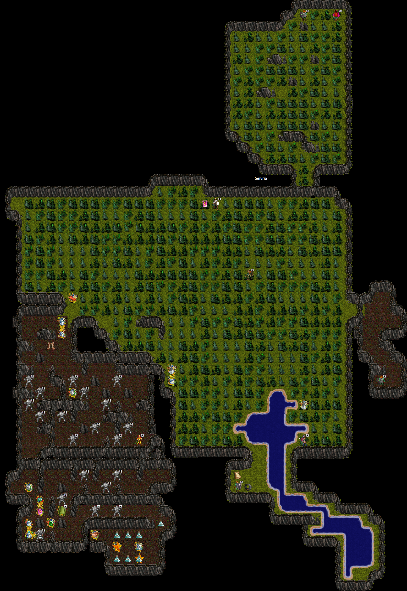

**Key Locations on the Forest Map**:
- **Mac** -- NPC in the north who accepts furs for Sick Caves access (located at the northwest area)
- **Sick Caves Climb Down** -- Entrance to Sick Caves after completing the fur quest
- **Wyverns Area Climb Up** -- Southwest area, leads up to the Wyvern hunting grounds (requires Climbing Pick)
- **Jarvoh** -- NPC near the south-center of the forest; turn in River Nuggets to progress to level 76
- **Mneer** -- NPC on the east side of the forest; trade 2 Thumper Rocks for a Climbing Pick
- **Cargon** -- NPC in the Thumper Caves area; turn in Cavebat Skin Scroll for Cavern Creeper I quirk
- **GiantBat Lair** -- Located in the Thumper Caves; drops the Cavebat Skin Scroll

### SDC World Overview
A broader view of the SDC world and how its areas connect.

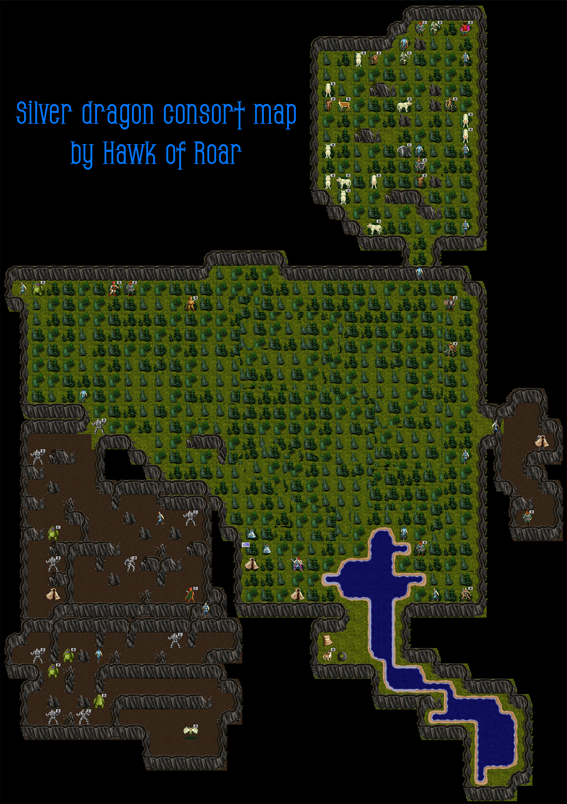

### SDC Wyverns Area
The Wyvern hunting grounds accessible from the SDC Forest via climbing.

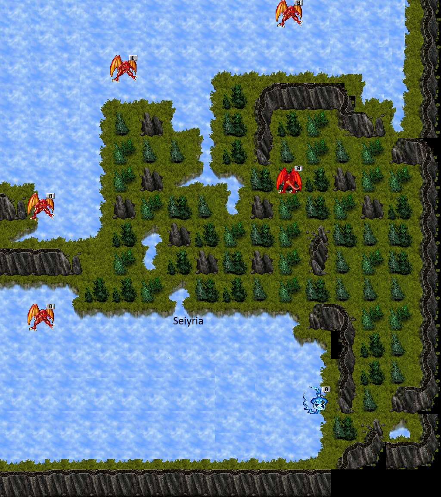

## Major Areas

### SDC Forest (Surface)
The starting area of SDC. Animals roam here that must be killed and tanned at **TrapperJohn** (located in the northeast) to obtain furs for the Sick Caves Access quest. Named NPC enemies in the forest drop River Nuggets used for the Level 76 progression quest.

### Thumper Caves / Rockman Caves
Underground caves accessed from the forest surface. Contains Thumpers and Rockmen that drop Thumper Rocks (quest items for the Climbing Pick) and Golden Nuggets. The **GiantBat** lair is found here, which drops the Cavebat Skin Scroll for the Cavern Creeper I quirk. Mend Potions, Constitution Potions, and other bottles also drop from crits in these caves.

### Sick Caves -1
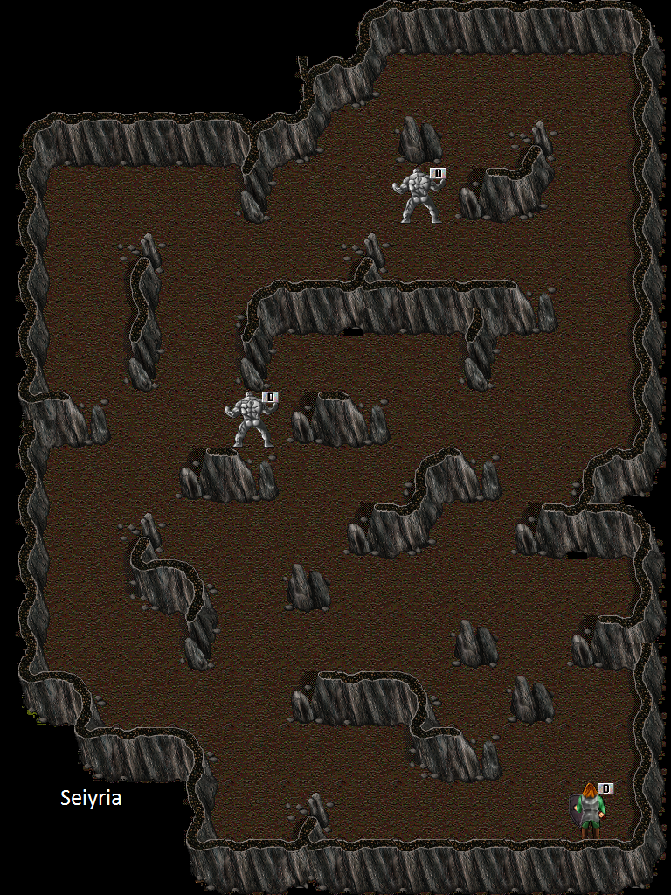

Accessed by completing the fur quest with Mac. Contains Wraiths wearing sashes that drop Wraith Cloth (needed for Sick Caves 2 Access quest). **Mac'** (Macsfriend) is located in the southeast corner and accepts Wraith Cloth and Spectre Silk for the Crystal Resistance I quirk and Sick Caves -2 access.

**Important**: When turning in your 5th Wraith Silk to Mac', you MUST select the dialog option asking about the climbdown, otherwise you will need another Wraith Silk to get that specific dialog option which flags you to climb down.

### Sick Caves -2
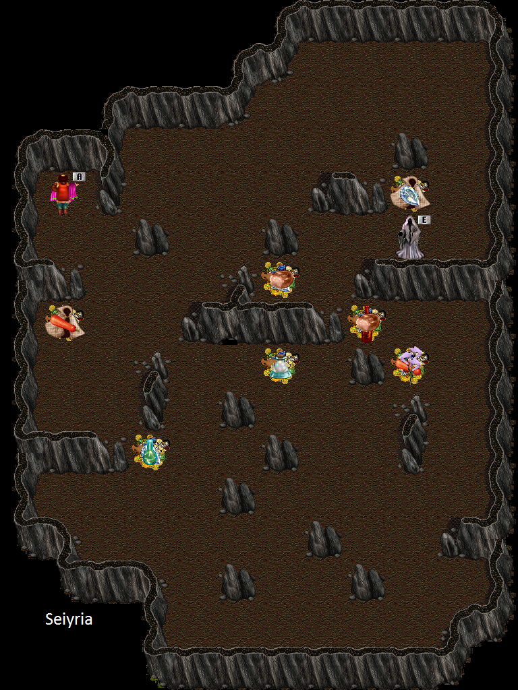

Deeper level of the Sick Caves, accessed after giving 5 Wraith Cloth to Mac'. Contains Spectres wearing sashes that drop Spectre Silk (needed for Crystal Resistance I). Dragon Scales also drop here for the Crystal Resistance II quirk. **Marburn** is located in the west area and accepts Dragon Scales.

### Wyvern Area (+1 and +2)

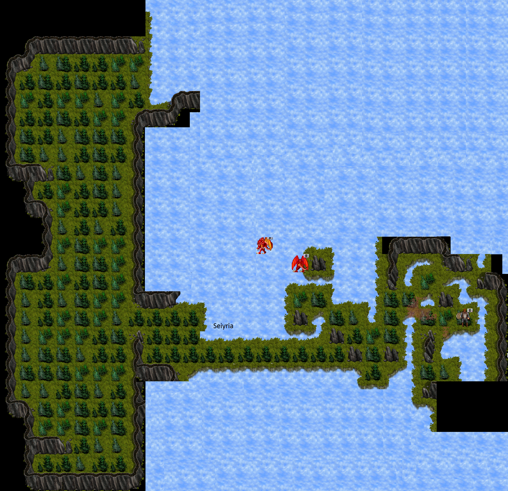

Accessed by using the Climbing Pick at the most northwest hex of SDC Forest. Wyverns here drop Crystalline Wyvern Talons needed for level 78 progression.

- **Wyverns +1**: Connects to the forest below and the higher Wyverns +2 area above
- **Wyverns +2**: Contains **Arpigo**, the NPC who accepts Wyvern Talons for level 78 progression (you must be level 76 to turn in). Also connects up to the Gnome Area

### Gnome Area (SDC2)
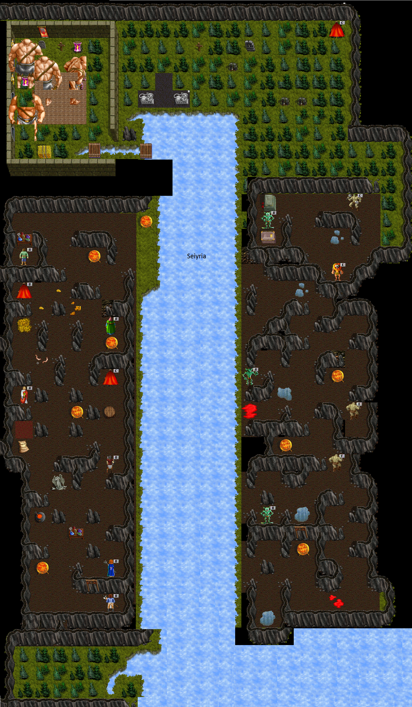
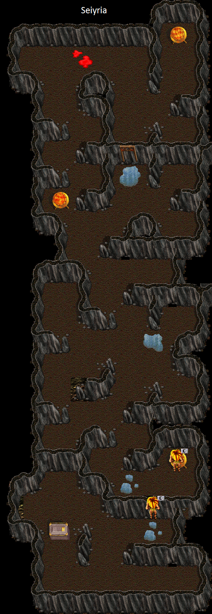

A large area containing gnome settlements and caves. Gnomes, ElderGnomes, Crushers, and Shamans drop Small Golden Nuggets, leathers, and plate armors used in many quests. A smelting pot in this area allows you to smelt nuggets and craft quest items.

**Key NPCs in Gnome Area**:
- **Jaxon** -- West safe area; accepts Gnome Heads for Cavern Creeper II quirk
- **Juan** -- Accepts Silver Extract for Tree Hugger I quirk
- **Armon** -- Accepts Large Nuggets for level 85 progression (must be level 78)
- **Modax** -- Trades Large Nuggets for a key to the Miner49er area
- **Alex** -- Accepts Refined Fluidic Crystals + Titan weapons for +12 Titan weapon upgrades
- **Goobert** -- NPC in the gnome town
- **Monrah** -- Located north; accepts Broadleaf Arrowhead flowers for Tree Hugger II quirk

### Gnome Cave -2
A deeper level below the Gnome Area. Contains additional gnome spawns and nugget sources.

### Miner Area (Miner49er)
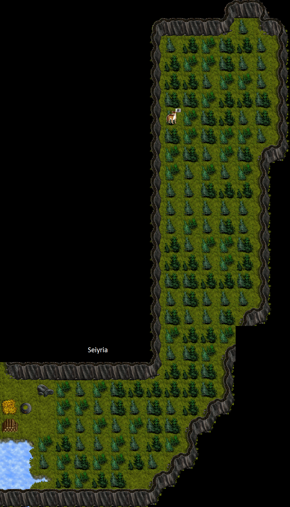

Optional area accessed by holding a key (obtained from Modax) and walking onto the SE hex in the Gnome caves. **Beware of the lair inside.** Connects to the Ice Floes area above and the Gnome Area below. You can bypass this by getting a Mass Teleport past it.

### Ice Floes (SDC2)
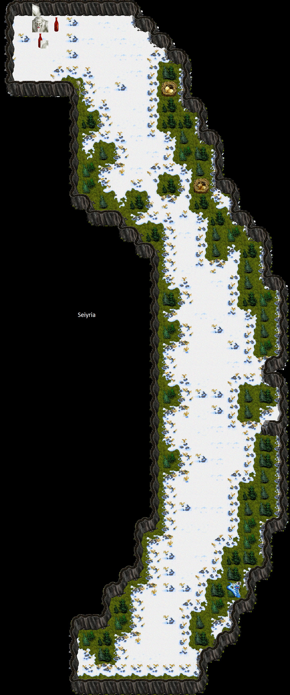

Contains the **IceTitan** lair in the northwest corner. Connects to the Meadows area above and the Miner Area below. Dark Knowledge pages 36-40 are found in this area.

### SDC3 Areas
SDC3 encompasses several distinct sub-zones:

#### SDC3 Solo Area
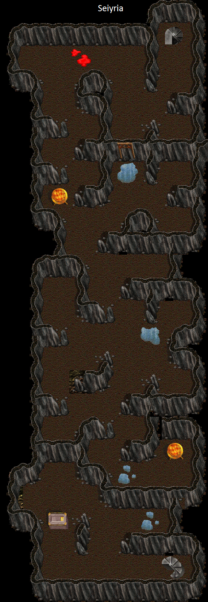 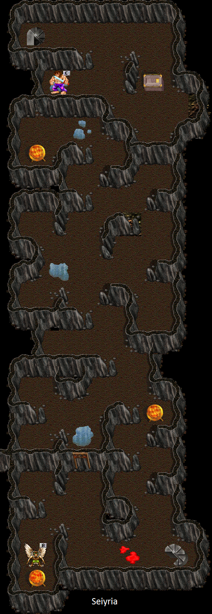 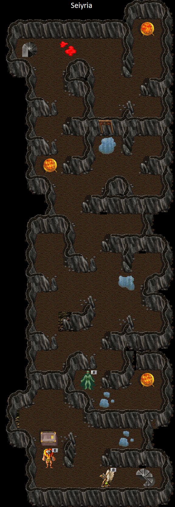 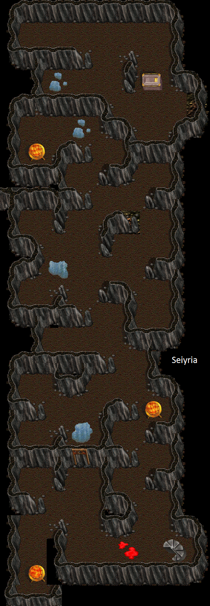

Solo caves with multiple levels (-1 through -4) accessed via stairs from Lava City. Contains:
- **AGI Pots** that increase your base AGI to 40 (requires level 80)
- Constitution Bottles (+1 CON until 25)
- Strength Bottles (+1 STR until 18)
- Dark Knowledge pages 16-20

#### SDC3 Meadows
An open area with various creatures. Dark Knowledge pages 21-25 are found here. Stat flowers (California Poppy, Canary Island Cress, Card Thistle, Cardoon) grow in this area and throughout SDC3 sub-zones.

#### SDC3 Water Area
Aquatic area containing Omnilla (drops Omnilla Skulls) and Carnifish (drops Chum), both used for the Root Armor quest. Dark Knowledge pages 31-35 are found here.

### Lava City / Lava Town (SDC3)
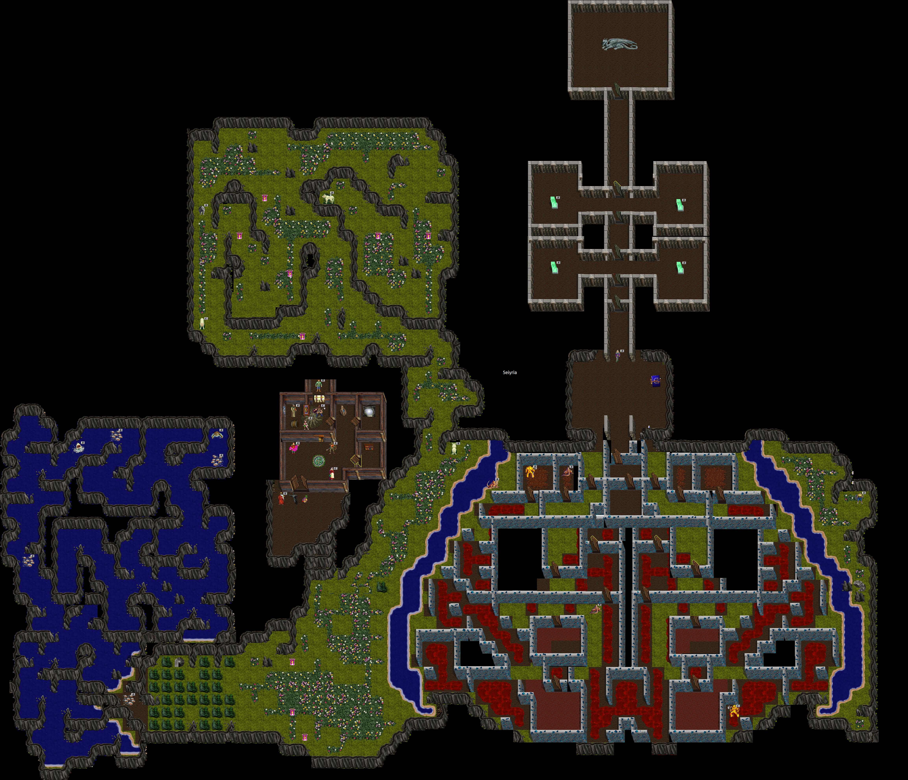

The major endgame hub of SDC. Contains shops, a fountain for brewing Gumbo, and access to the most powerful lairs. Firegiants and Firelords roam the area and can drop Firegiant Armor and LavaCity Shields. LavaMentals and LavaLizards drop Healer and Mentalist Totems. Dark Knowledge pages 26-30 are found here.

**Key NPCs in Lava City**:
- **Worster** -- In SDC Town; accepts Gumbo for Root Armor upgrades
- **Hermit** -- East side of Lava City; accepts Lava Twigs for Root Weapon upgrades
- **Rogue** -- In Lava Town; accepts stat flowers + 50m bank balance for base stat increases to 35

**Key Locations**:
- **Stairs to Sullen Keep Forest** -- Southeast of Lava City (must be level 85 to go up)
- **Stairs Down to Solo Caves** -- Southwest area of Lava City

### Gnoll Area
Located near the gnome area. Contains a shop that sells primal protection bottles (ice, fire, lightning, crystalline shield). Gnoll caves also drop these bottles.

## Lairs

### GiantBat
- **Location**: Thumper Caves (SDC Forest)
- **Abilities**: Stuns, damages gear
- **Drops**: Cavebat Skin Scroll (used for Cavern Creeper I quirk)

### Betrayer
- **Location**: SDC3 (Gnome Area upper level)
- **Abilities**: Powerful melee attacks
- **Drops**: Betrayer Armor (Lv80 req, 7/7, Betrayal of Ice, Fire/Ice Prot), Betrayer Mace (Lv80, 8/8, Lesser Intelligence Elixir, +2 INT, +10 STR/WIS/AGI), Betrayer Shield (Lesser Strength Elixir, adds 100 separate damage), Large Nugget, Gnomes Ring

### IceTitan
- **Location**: Ice Floes
- **Abilities**: Nasty Icebreath, only aggros if you attack him (safe for healers), primal stuns
- **Drops**: IceTitan Ring (9/9, +8 all stats, random Ice/Fire/Lightning Inflation/Ablation II), 1 SDC level tier, 1-4 rings per kill

### Skar
- **Location**: Lava City
- **Abilities**: Shreds, damage reflect, breaks bottles. Will eat you if you die
- **Drops**: Skar Armor (Lv82 req, 7/7, Base AC 800, Hammer of Skar), Skar Key (for OzonousMax access)
- **Tips**: Tan to get armor

### Spur
- **Location**: Lava City
- **Abilities**: Strong lightning attack, claws, breaks bottles. Will eat you if you die
- **Drops**: Spur Robe (Lv82 req, 5/5, +2 AGI/INT/STR/WIS, Base AC 100, 1600 Lightning Prot), Spur Key (for OzonousMax access)
- **Tips**: Tan to get robe

### OzonousMax
- **Location**: Lava City (behind locked doors requiring Skar Key and Spur Key)
- **Abilities**: Sucks stats, breaks bottles, mean lightning attack, claws. Will eat you if you die
- **Drops**: Ozonous Armor (Lv82 req, 10/10, +10 all stats, Lightning Prot, 250 damage absorption), Ozonous Bracers (three variants: Strike, Armor, Regeneration), Dark Knowledge Pages (random 1-35), 4 random stat flowers, 4 Essence Twigs
- **Access**: Collect keys from both Skar and Spur and use them to open the doors leading to OzonousMax

### Corosonous
- **Location**: Lava City (north area)
- **Abilities**: Strong acid attack, claws, breaks bottles. Will eat you if you die
- **Prerequisites**: Finish Dark Knowledge before doing this fight. Kill each pylon before the lair to activate Corosonous. The pylons only need to be killed once but should be prevented from reaching Corosonous. You cannot hit the pylons with melee unless you have the Dark Knowledge quirk.
- **Tips**: Bring Acid protection (2 AcidronAlcor robes)
- **Drops**: Broom (Lv80 req, 20/20), Dark Knowledge Pages (random 1-35), 4 random stat flowers, 4 Essence Twigs
- **Reward Choice**: At the end of the fight, choose a Broom OR improve any of the 3 SDC quirks (Tree Hugger, Air Head, Cavern Creeper)

### Miner49er
- **Location**: Gnome Area (accessible with key from Modax)
- **Details**: Optional lair, can be bypassed with Mass Teleport

### UberSkar (Limited Time)
- **Location**: Lava City
- **Drops**: UberSkar Armor (Lv82 req, 10/10, Base AC 1000, Two Handed Hammer of Skar)
- **Notes**: Limited time event lair

## NPCs

| NPC | Location | Purpose |
|-----|----------|---------|
| **Arbiter** | SE of GDH2 | Entry to SDC (level 40 required) |
| **Mac** | SDC Forest (north) | Accepts 4 furs for Sick Caves access |
| **TrapperJohn** | SDC Forest (northeast) | Tans animals into furs |
| **Jarvoh** | SDC Forest (south-center) | Accepts River Nuggets for level 76 progression |
| **Mneer** | SDC Forest (east) | Trades 2 Thumper Rocks for Climbing Pick |
| **Cargon** | Thumper Caves | Accepts Cavebat Skin Scroll for Cavern Creeper I |
| **Mac'** (Macsfriend) | Sick Caves -1 (SE corner) | Accepts Wraith Cloth/Spectre Silk for Crystal Resistance I and Sick Caves -2 access |
| **Marburn** | Sick Caves -2 (west) | Accepts Dragon Scale for Crystal Resistance II |
| **Arpigo** | Wyverns +2 (east side) | Accepts Wyvern Talons for level 78 progression |
| **Jaxon** | Gnome Area (west safe area) | Accepts Gnome Heads for Cavern Creeper II |
| **Juan** | Gnome Area | Accepts Silver Extract for Tree Hugger I |
| **Armon** | Gnome Area | Accepts Large Nuggets for level 85 progression |
| **Modax** | Gnome Area | Trades Large Nugget for Miner49er key |
| **Alex** | Gnome Area | Upgrades Titan weapons with Refined Fluidic Crystal |
| **Monrah** | Gnome Area (north, near Betrayer) | Accepts Broadleaf Arrowhead for Tree Hugger II |
| **Rogue** | Lava Town | Accepts stat flowers + 50m bank for stat increase to 35 |
| **Worster** | SDC Town (Lava City) | Accepts Gumbo for Root Armor upgrades |
| **Hermit** | Lava City (east) | Accepts Lava Twigs for Root Weapon upgrades |

## Primal Quirks Available

| Quirk | Levels | How to Obtain |
|-------|--------|---------------|
| **Cavern Creeper I** | 1 point | Turn in Cavebat Skin Scroll to Cargon |
| **Cavern Creeper II** | 2nd point | Turn in Gnome Head to Jaxon in Gnome Town |
| **Tree Hugger I** | 1 point | Smelt 8 plate armors into Silver Extract, give to Juan |
| **Tree Hugger II** | 2nd point | Bring Broadleaf Arrowhead flower to Monrah |
| **Crystal Resistance I** | 1 point | Bring 5 Spectre Silk to Mac' in Sick Caves |
| **Crystal Resistance II** | 2nd point | Bring Dragon Scale to Marburn in Sick Caves -2 |
| **Dark Knowledge** | 1 point | Collect all 40 pages + book, complete the quest |
| **Air Head** | Available | Progressed through SDC content |

## Progression Summary

1. **Enter SDC** at level 40 (via GDH2 SE or Jilian)
2. **Level to 74+** before engaging SDC content seriously
3. **Complete Sick Caves Access** (collect 4 furs, trade to Mac)
4. **Get Climbing Pick** (2 Thumper Rocks to Mneer)
5. **Progress to Level 76** (River Nugget to Jarvoh)
6. **Progress to Level 78** (Wyvern Talon to Arpigo, must be Lv76)
7. **Progress to Level 85** (64 Small Nuggets -> 1 Large Nugget to Armon, must be Lv78)
8. **Note**: If you did not complete BDC Hermit before level 85 to advance to skill 39, you will be capped at skill 39. To fix this, turn in another Large Nugget.
9. **Advance to Sullen Keep** at level 85 (stairs in SE Lava City)
