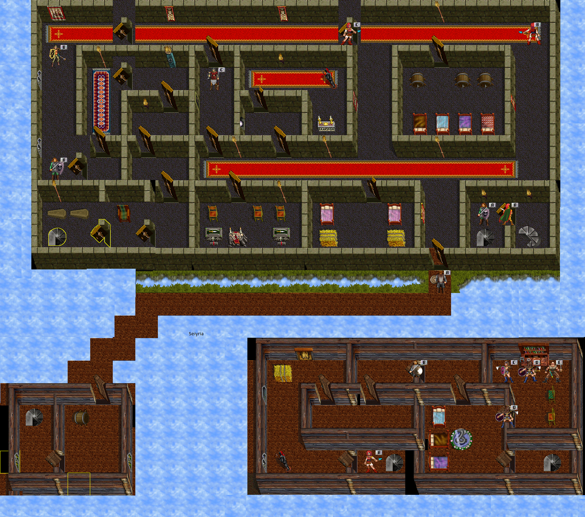
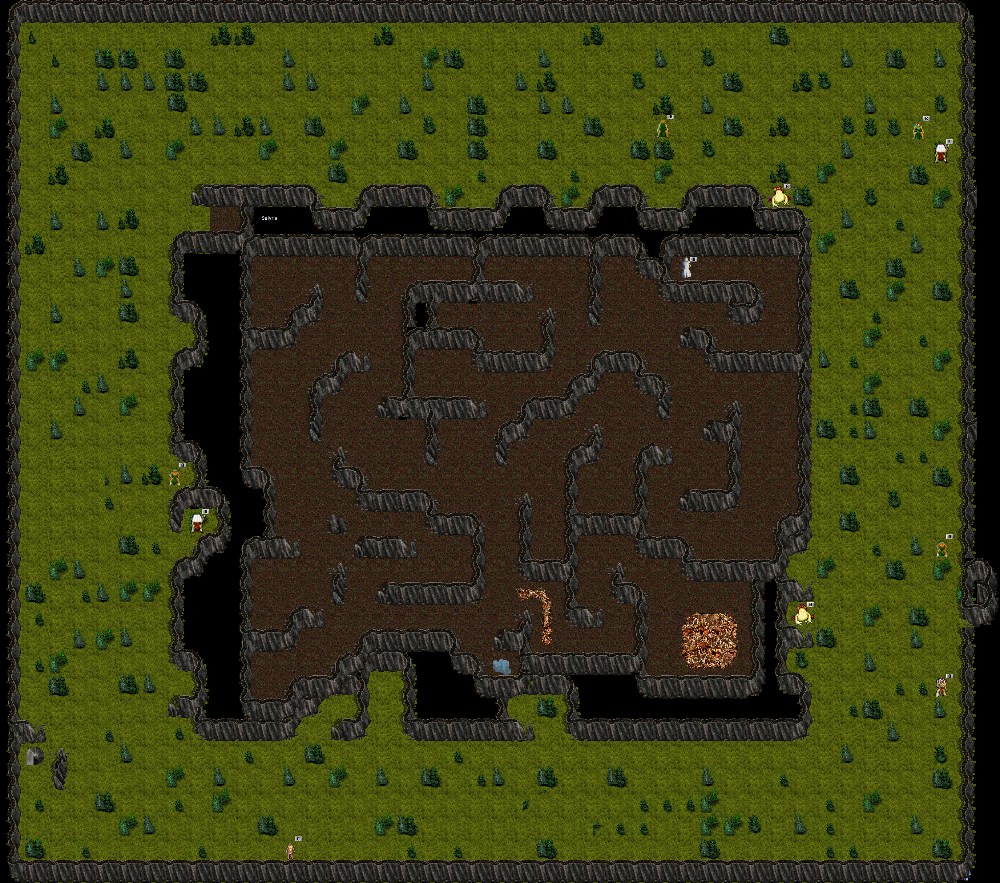
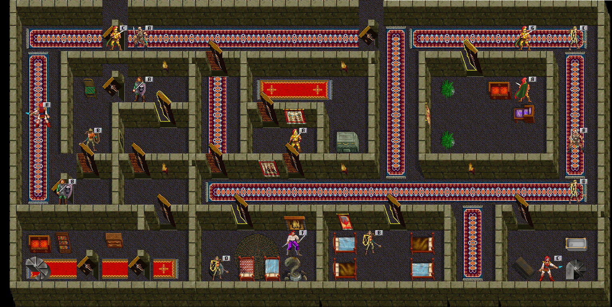
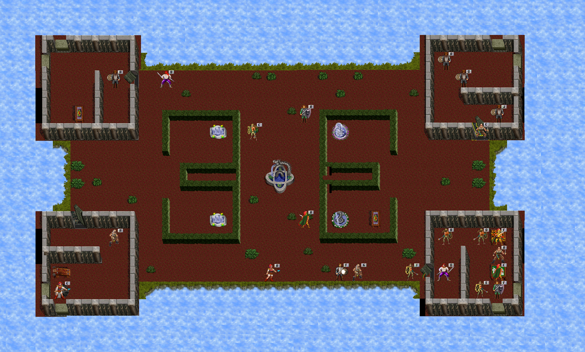

# The World of Sullen Keep

Sullen Keep (SK) is the highest-level area in Kingdom of Drakkar, considered an extension to the Nameless Lands and sharing the same "alts" with it. It is a fortified keep that adventurers ascend through progressively more dangerous floors, each guarded by color-coded armored enemies. Entry requires reaching level 85 and completing a quest in the Silver Dragon Consort (SDC) area.

## Entry Requirements

- **Minimum Level**: 85
- **How to Enter**: Travel to the east area of SDC3, past Lava City, and find a set of steps. Go up the steps to enter the Sullen Keep.

## Maps

### Sullen Keep - Level 0 (Base Level)

The base level of the keep, also called the Silver area. This floor contains:
- **Armornon** - NPC who sells armor molds for the SK Armor quest
- **Forger** - NPC who assembles completed armor molds and pages into finished armor
- **Black Captain Lair** - Located on this floor
- **Stairs to Barracks** - Connects to the cave/forest area below (Progression 3)

### Sullen Keep - Level 1

The Gold area of the keep. This floor contains:
- **Gold Captain Lair** - Located centrally on this floor
- **Stairs to Black Level** (Progression 4) - Requires level 88
- **Stairs to Green Level** (Progression 5) - Requires level 90

## Major Locations

### Sullen Keep Forest / Cave

### Sullen Keep Forest
The initial outdoor area upon entering Sullen Keep from SDC. Features forests and wildlife including bears and Hunters. This is where the first progression quest takes place, requiring players to slay Hunters for an agility-like progression potion.

- A vendor named **Shady** sells anti-prone potions for 3 million gold

### Sullen Keep Cave
An underground cavern accessible after completing the first progression quest (drinking the agility pot). Contains the **Sullen Basilisk** lair in the southeast corner. Creatures here drop Climbing Book pages and the Climbing Book itself, required for Progression 2.

### Silver Floor (Keep Base / +0)
The first floor of the keep proper, featuring silver-armored enemies. Contains the armor quest NPCs (Armornon and Forger) and the Black Captain lair. Silver enemies can drop silver armor pages and rarely gold armor pages.

### Gold Floor (Keep +1)
The second floor featuring gold-armored enemies. Contains the Gold Captain lair. Gold enemies can drop gold armor pages and rarely black armor pages.

### Black Floor (Keep +2)

The third floor featuring black-armored enemies. Contains the Green Captain lair. Black enemies can drop black armor pages and rarely green armor pages.

### Green Floor / Parapets (Keep +3)

The fourth and highest standard floor featuring green-armored enemies. Green enemies can drop green armor pages and rarely parapet-tier armor pages.

### Parapets (Keep +3)
The final and most dangerous area of Sullen Keep. Enemies here drop the Invasion Scroll needed for the level 95+ progression quest. The stairs from the Green Level lead here.

## Progression System

Sullen Keep features a multi-stage progression system that gates level advancement:

| Quest | Levels Unlocked | Requirements |
|-------|----------------|--------------|
| **Progression 1** (Cave Entry) | 85 to 86/87 (Skill cap 42) | Slay Hunters in SK Forest, find and drink an AGI pot (requires level 85). Grants access to SK Cave. |
| **Progression 2** (Cave Climb) | 86 to 87 | Kill creatures in SK Cave to find a Climbing Book and 10 Climbing Pages. Fill the book (right-click to add pages). Climb up on the puddle at level 86. |
| **Progression 3** (Silver Stairs) | 87 to 88 | Use the stairs between cave and SK Silver floor. Can be done any time after Progression 2. |
| **Progression 4** (Gold Stairs) | 88 to 90 | Once level 88, take the stairs to the Black area of SK. Must clear all enemies around the steps. |
| **Progression 5** (Black Stairs) | 90 to 95 | Once level 90, take the stairs to the Green area of SK. |
| **Progression 6** (Invasion Scroll) | 95 to 99 | Find an Invasion Scroll from Parapet enemies and bring it to a diplomat in NL. |

## SK Armor Quest

Throughout the Sullen Keep, enemies drop armor pages. To craft SK armor:

1. Purchase an **armor mold** from **Armornon** (located on the Silver floor) matching the armor type you want
2. Collect **pages 1 through 10** of the desired armor tier
3. Bring the mold and all 10 pages to the **Forger** NPC (also on the Silver floor)

### Armor Tiers

There are two armor types per tier:
- **Fieldplates** - For Barbarians and Martial Artists
- **Boneplates** - For all other classes (Fighter, Paladin, Thief, Healer, Mentalist)

### Page Drop Locations

| Page Tier | Primary Drop | Rare Drop |
|-----------|-------------|-----------|
| Silver Pages | Gold enemies (frequent) | Silver enemies (infrequent) |
| Gold Pages | Black enemies (frequent) | Gold enemies (infrequent) |
| Black Pages | Green enemies (frequent) | Black enemies (infrequent) |
| Green Pages | Parapet enemies (frequent) | Green enemies (infrequent) |

## Notable NPCs

| NPC | Location | Function |
|-----|----------|----------|
| **Armornon** | Silver Floor (Keep Base) | Sells armor molds for the SK Armor quest |
| **Forger** | Silver Floor (Keep Base) | Assembles armor molds + 10 pages into finished armor |
| **Shady** | SK Forest/Cave area | Sells anti-prone potions for 3 million gold |
| **NL Diplomat** | Nameless Lands | Accepts Invasion Scroll for level 95+ progression |

## Lairs

| Lair | Location | Notable Drops | Notes |
|------|----------|---------------|-------|
| **Sullen Basilisk** | SK Cave (southeast) | Stat Pot, Basilisk Gripclaws | Stuns. Breaks bottles. |
| **Gold Captain** | Gold Floor (+1) | Stat Pot, Gold Captain Boots | -- |
| **Black Captain** | Silver Floor (Keep Base / +0) | Stat Pot, Black Captain Gripclaws | -- |
| **Green Captain** | Black Floor (+2) | Stat Pot, plus any 2 rares (amulets, bracers, earrings, sash, helm) | Drops any 2 rares and a stat pot. Very tough fight. |

### Green Captain Rare Drop Table

The Green Captain can drop any two of the following rare items:
- Attack Amulet (Sullen Offense Amulet)
- Stolen Skill Amulet
- Battle Cleric Amulet
- Nightwalker Amulet
- Sullen Bracers (Armor variant)
- Sullen Bracers (Regeneration variant)
- Sullen Bracers (Strike variant)
- Sullen Insight I Earring
- Sullen Insight II Earring
- Sullen Sash
- Spartan Helm (Green Captain Helm)
